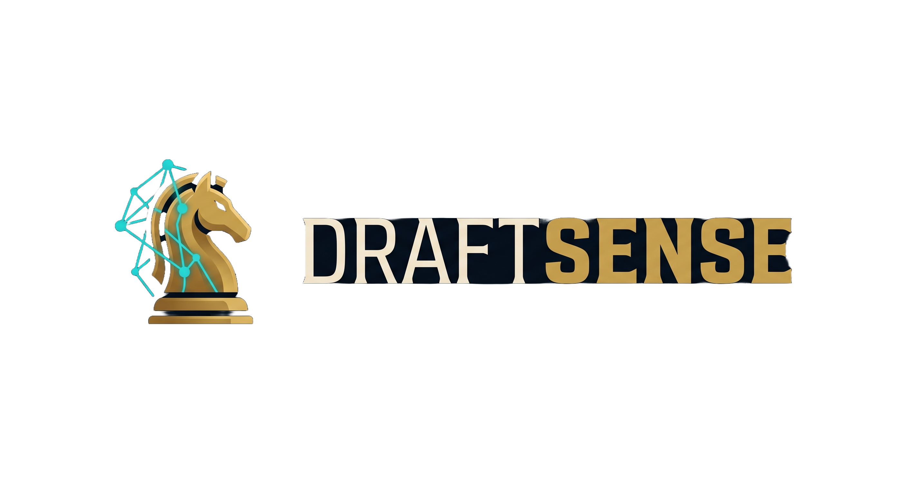

<p align="center">
  
</p>

<p align="center">
  <strong>Your Machine Learning-powered League of Legends champion draft advisor.</strong><br/>
  Real-time counter picks, team synergy analysis, rune pages & item builds - all in one place.
</p>

<p align="center">
  
  
  
  
  
</p>

---

## What is DraftSense?

DraftSense is a full-stack, microservice-based web application built for League of Legends players who want a competitive edge during champion select. By inputting the active draft state—including bans, enemy picks, ally picks, and your selected role—DraftSense's machine learning engine predicts the optimal champions for your game. 

Rather than relying on generic static charts, DraftSense employs a trained **XGBoost gradient boosting model** to run predictive real-time analysis against professional and high-elo draft data. It balances direct lane counters with overall team synergy, then renders a complete tactical strategy: optimal runes, item build orders, skill leveling paths, and threat-specific counter items.

> Think of it as your personal machine learning analyst whispering in your ear during champion select.

---

## Key Features

*   **XGBoost Draft Analytics:** Predictive engine leveraging a gradient-boosting model to calculate win-rate changes dynamically as drafts unfold.
*   **Microservice Architecture:** Independent Express API backend (Node.js/TypeScript) paired with a high-performance Python FastAPI service for machine learning inference.
*   **Dual-Engine Recommendation Pipeline:** Uses statistically enriched local database metrics as a robust default with real-time ML model overriding when the FastAPI service is active.
*   **Deterministic Rationale Engine:** A lightning-fast, zero-overhead template-based explanation system that generates direct mechanical counters and team synergies without expensive LLM APIs.
*   **Adaptive Itemization Guides:** Generates role-specific core items and dynamically flags situational counter items based on identified enemy draft threats (e.g., Tenacity against Thresh hooks, early armor/healing reduction against Darius).
*   **Full Build Guide Visualization:** Interactive visual summaries detailing optimal runes, starter/core/situational items, skill-max order, and visual lane-threat analysis.
*   **Dockerized Deployment:** Complete pre-configured multi-container Docker Compose setup for instant frontend, backend, and machine learning service startup.
*   **LoL Client Aesthetic:** A gorgeous, responsive glassmorphic UI matching League of Legends' cinematic "Sovereign War Room" visual layout.

---

## Application Flow

```
1. Select your target role (Top / Jungle / Mid / Bot / Support)
         ↓
2. Update the Draft Board in real-time:
   • 10 Ban slots (5 per team)
   • 5 Enemy picks (positioned by role)
   • 4 Ally picks (your target role slot is locked)
         ↓
3. Machine Learning Inference (FastAPI + XGBoost):
   • Evaluates candidate champions against 10 draft variables
   • Ranks 5 Best Counter Picks (XGBoost scored)
   • Ranks 5 Best Synergy Picks (XGBoost scored)
   • Calculates Top 3 Overall Picks (combined weighted probability)
         ↓
4. Select champion → Get real-time Tactical Build Guide:
   • Complete Rune page recommendations
   • Optimal starter, core, and threat-specific situational items
   • Skill leveling priority & specific lane-matchup tips
```

---

## Tech Stack

### Frontend
| Technology | Purpose |
|---|---|
| **React 18 + TypeScript** | Client architecture & component composition |
| **Vite** | Lightning-fast asset building & hot-module replacement |
| **React Router v6** | Client-side routing and multi-page workflow |
| **Zustand** | Centralized client-side draft state management |
| **Tailwind CSS** | Premium cinematic layout styling and design system |
| **Framer Motion** | Fluid animations, card reveals, and micro-transitions |
| **TanStack Query (v5)**| Asynchronous backend state syncing and API caching |
| **Axios** | REST client for backend calls |

### Backend API
| Technology | Purpose |
|---|---|
| **Node.js + Express** | Core server application logic & REST API |
| **TypeScript** | Absolute type-safety across endpoints |
| **MongoDB + Mongoose** | Datastore & ODM for champion metadata and base metrics |
| **Riot Data Dragon API** | Live champion asset, rune, and item seeding |
| **Zod** | Strongly-typed Express route request validation |
| **Helmet & Express Rate Limit** | Hardened server API security |

### Machine Learning Service
| Technology | Purpose |
|---|---|
| **FastAPI (Python 3.10+)** | High-performance inference server with async lifespan management |
| **Uvicorn** | ASGI server for serving the FastAPI endpoints |
| **XGBoost** | Gradient-boosted decision tree algorithm for win probability |
| **Scikit-Learn** | Feature engineering and data preprocessing utilities |
| **Pandas / NumPy** | Multi-dimensional array and tabular data analysis |
| **RiotWatcher** | Python-based client wrapper for fetching draft training history |
| **PyMongo** | Fetching and loading raw match collections directly from MongoDB |

### Infrastructure
| Service | Purpose |
|---|---|
| **Docker & Docker Compose** | Microservice orchestration (Client, Express API, ML Service) |
| **MongoDB Atlas** | Fully managed cloud database clustering |
| **Vercel** | Fast static hosting for the React client |
| **Render / Railway** | Scalable container hosting for Express and FastAPI services |
| **NVIDIA CUDA** | Optional GPU-acceleration support for local model training |

---

## Getting Started

You can run DraftSense either using **Docker Compose** (recommended for instant microservice setup) or by starting the components **manually**.

### Prerequisites
*   [Docker Desktop](https://www.docker.com/products/docker-desktop/) (For Docker deployment)
*   [Node.js v18+](https://nodejs.org/) (For manual setup)
*   [Python 3.10+](https://www.python.org/) (For manual ML service setup)
*   [MongoDB Atlas](https://www.mongodb.com/atlas) account (or a local MongoDB instance)
*   [Riot Developer Portal API Key](https://developer.riotgames.com/) (For draft training collection/seeding)

---

### Option A: Running with Docker Compose (Recommended)

1.  **Clone the repository:**
    ```bash
    git clone https://github.com/yourusername/draftsense.git
    cd draftsense
    ```

2.  **Configure environment variables:**
    Copy the main `.env.example` to `.env` in the root folder:
    ```bash
    cp .env.example .env
    ```
    Open the newly created `.env` file and fill in your details:
    *   Set your `MONGO_URI` connection string.
    *   Paste your `RIOT_API_KEY` (obtained from the Riot Developer Portal).

3.  **Boot the microservices:**
    Spin up all containers (Frontend, Backend, ML Service):
    ```bash
    docker-compose up --build
    ```
    Once built and launched:
    *   **Frontend UI:** accessible at `http://localhost:5173`
    *   **Express API Backend:** running at `http://localhost:5000`
    *   **FastAPI ML Service:** listening at `http://localhost:8000`

---

### Option B: Manual Local Setup

If you prefer to run the services individually without Docker, configure each microservice manually:

#### 1. Setup the Python ML Service
```bash
cd ml_service
# Create and activate a Python virtual environment
python -m venv venv
# Windows:
.\venv\Scripts\activate
# macOS/Linux:
source venv/bin/activate

# Install requirements
pip install -r requirements.txt

# Run the FastAPI server (starts on http://localhost:8000)
uvicorn api.main:app --host 0.0.0.0 --port 8000 --reload
```

#### 2. Setup the Express Server
In a new terminal:
```bash
cd server
npm install
# Create local env file
cp .env.example .env
# Set MONGO_URI, PORT=5000, and ML_SERVICE_URL=http://localhost:8000
```

#### 3. Setup the React Client
In a third terminal:
```bash
cd client
npm install
# Create local env file
cp .env.example .env
# Ensure VITE_API_BASE_URL=http://localhost:5000/api
```

#### 4. Seed the Database
Before running for the first time, seed champion assets, items, and runes from Riot's Data Dragon:
```bash
cd server
npm run seed
```

#### 5. Run Development Servers
Start both the client and server manually (make sure `ml_service` is also running):
```bash
# In /server
npm run dev

# In /client
npm run dev
```

---

## Environment Variables

### Root Unified Configuration (`.env`)
Both the local environment and `docker-compose.yml` share a unified root `.env` configuration:

```env
# Express Server (Node.js)
PORT=5000
NODE_ENV=development
CLIENT_URL=http://localhost:5173
ML_SERVICE_URL=http://localhost:8000

# Machine Learning Service (FastAPI)
RIOT_API_KEY=RGAPI-xxxx-xxxx-xxxx-xxxxxxxxxxxx
MONGO_URI=mongodb+srv://<username>:<password>@your-cluster.mongodb.net/draftsense
MODEL_PATH=models/trained/xgboost_v1.pkl
CURRENT_PATCH=14.8
ML_PORT=8000

# React Client (Vite)
VITE_API_BASE_URL=http://localhost:5000/api
```

---

## Project Structure

```
draftsense/
├── client/                      # React Frontend
│   ├── src/
│   │   ├── components/
│   │   │   ├── common/          # ChampionCard, ChampionSearch, RoleIcon
│   │   │   ├── draft/           # BanRow, TeamColumn, DraftBoard, StateSummary
│   │   │   └── results/         # RecommendationCard, RuneDisplay, BuildOrder
│   │   ├── pages/               # RoleSelect, DraftInput, Recommendations, BuildGuide
│   │   ├── store/               # Zustand global state store
│   │   ├── hooks/               # useChampions, useRecommendations
│   │   └── api/                 # Axios client configuration
│
├── server/                      # Express Backend
│   ├── src/
│   │   ├── models/              # Champion, Matchup, Synergy, Build schemas
│   │   ├── routes/              # Express API endpoints
│   │   ├── controllers/         # recommendController, buildController
│   │   ├── services/            # statsService, mlService, explanationService
│   │   └── scripts/             # seedDatabase
│
├── ml_service/                  # Machine Learning Service
│   ├── api/                     # FastAPI entry (main, routes, predictor, schemas)
│   ├── models/                  # ML models, training pipelines, and evaluations
│   │   └── trained/             # Serialized model directory (xgboost_v1.pkl)
│   ├── data/                    # Match extraction, preprocessors, feature lists
│   ├── notebooks/               # Jupyter notebooks for model exploration & tuning
│   └── requirements.txt         # Python library dependencies
│
├── docker-compose.yml           # Unified multi-service Docker configuration
├── .env.example                 # Environment variables blueprint
└── README.md                    # Project documentation
```

---

## Machine Learning Recommendation Engine

DraftSense runs a highly efficient, hybrid recommendation pipeline designed to combine high-performance database metrics with complex gradient-boosted modeling:

```
[Draft Input] ──> [statsService.ts] ──> [mlService.ts (FastAPI /predict)] ──> [explanationService.ts] ──> [Rendered UI]
                     (Local Base)             (XGBoost Override)            (Deterministic Rules)
```

1.  **Baseline Statistical Scoring ([statsService.ts](file:///d:/University%20Files/Projects/DraftSense/server/src/services/statsService.ts)):** 
    Computes direct math-based matchups using historical win/loss, lane-specific counter ratios, and team synergy coefficients stored directly in MongoDB. This acts as a robust, sub-10ms baseline and automatic fallback if the ML service is not active.
2.  **XGBoost Win-Rate Inference ([mlService.ts](file:///d:/University%20Files/Projects/DraftSense/server/src/services/mlService.ts) ──> FastAPI `/predict`):** 
    When active, the Express API sends the draft state to the FastAPI service. The service vectorizes the bans, ally picks, and enemy picks, passing them into the pre-trained **XGBoost model (`xgboost_v1.pkl`)**. The model outputs the predicted team win probability for each candidate champion in real-time.
3.  **Deterministic Explanations ([explanationService.ts](file:///d:/University%20Files/Projects/DraftSense/server/src/services/explanationService.ts)):** 
    To avoid high API costs, slow latency, and hallucinations of LLMs, DraftSense uses an optimized, rule-based template translator. It instantly parses the prediction scores and direct matchups to construct precise, professional mechanical suggestions and tactical items.

---

## Roadmap

- [x] Project planning & architecture design
- [x] High-fidelity dark mode "Sovereign War Room" visual UI
- [x] Dynamic draft board input with full-text search
- [x] Champion data database seeding (Riot Data Dragon integration)
- [x] Baseline statistical scoring algorithm for counters & synergy
- [x] Custom XGBoost machine learning model training pipeline
- [x] High-performance Python FastAPI microservice
- [x] Docker Containerization & Docker Compose setup
- [x] Highly responsive mobile layout & visual scaling
- [x] Real-time tactical build guide with rune page rendering
- [x] Deterministic explanation engine (replacing LLMs for high stability)
- [ ] Production cloud deployment on Vercel & Render

---

## Contributing

Contributions, issues, and feature requests are welcome!

1. Fork the repository
2. Create your feature branch (`git checkout -b feature/AmazingFeature`)
3. Commit your changes (`git commit -m 'Add some AmazingFeature'`)
4. Push to the branch (`git push origin feature/AmazingFeature`)
5. Open a Pull Request

---

## Disclaimer

DraftSense is not affiliated with, endorsed by, or sponsored by Riot Games. League of Legends and all related assets are property of Riot Games. Champion data is sourced from the [Riot Data Dragon](https://developer.riotgames.com/docs/lol) public API.

---

## License

Distributed under the MIT License. See `LICENSE` for more information.

---

<p align="center">
  Built with ❤️ for the League of Legends community<br/>
  <sub>DraftSense - Pick smarter. Win more.</sub>
</p>
